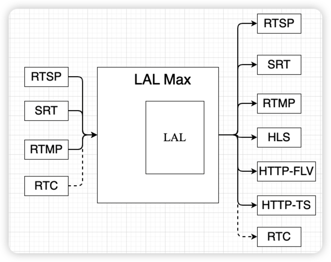

# lalmax
lalmax是在lal的基础上集成第三方库，可以提供SRT、RTC、mp4、gb28181、onvif等解决方案

# 编译
./build.sh

# 运行
./run.sh或者./lalmax -c conf/lalmax.conf.json

# 配置说明
lalmax.conf.json配置主要由2部分组成

(1) lal_config_path表示lal配置文件的路径,用于加载lal本身的配置,具体配置说明见[lal配置](https://pengrl.com/lal/#/ConfigBrief)

(2) 剩余的配置则为lalmax的配置,具体配置说明见[config.md](./document/config.md)


# docker运行
```
docker build -t lalmax:init ./

docker run -it -p 1935:1935 -p 8080:8080 -p 4433:4433 -p 5544:5544 -p 8083:8083 -p 8084:8084 -p 30000-30100:30000-30100/udp -p 1290:1290 -p 6001:6001/udp lalmax:init

```

# 架构



# 支持的协议
## 推流
(1) RTSP 

(2) SRT

(3) RTMP

(4) RTC(WHIP)

(5) GB28181

具体的推流url地址（除了srt/whip）

https://pengrl.com/lal/#/streamurllist

## 拉流
(1) RTSP

(2) SRT

(3) RTMP

(4) HLS(S)-TS

(5) HTTP(S)-FLV

(6) HTTP(S)-TS

(7) RTC(WHEP)

(8) HTTP(S)-FMP4

(9) HLS(S)-FMP4/LLHLS


具体的拉流url地址见https://pengrl.com/lal/#/streamurllist（除了srt/whep）

## [SRT](./document/srt.md)
（1）使用gosrt库

（2）暂时不支持SRT加密

（3）支持H264/H265/AAC

（4）可以对接OBS/VLC

```
推流url
srt://127.0.0.1:6001?streamid=#!::h=test110,m=publish

拉流url
srt://127.0.0.1:6001?streamid=#!::h=test110,m=request
```

## [WebRTC](./document/rtc.md)
（1）支持WHIP推流和WHEP拉流,暂时只支持POST信令

（2）支持H264/G711A/G711U/OPUS

（3）可以对接OBS、vue-wish

（4）WHEP支持对接Safari HEVC

（5）支持datachannel,只支持对接jessibuca播放器

（6）WHIP支持对接OBS 30.2 beta HEVC

datachannel播放地址：webrtc://127.0.0.1:1290/webrtc/play/live/test110

```
WHIP推流url
http(s)://127.0.0.1:1290/webrtc/whip?streamid=test110

WHEP拉流url
http(s)://127.0.0.1:1290/webrtc/whep?streamid=test110
```

## Http-fmp4
(1) 支持H264/H265/AAC/G711A/G711U

```
拉流url
http(s)://127.0.0.1:1290/live/m4s/test110.mp4
```

## HLS(fmp4/Low Latency)
(1) 支持H264/H265/AAC/OPUS

```
拉流url
http(s)://127.0.0.1:1290/live/hls/test110/index.m3u8
```

## [GB28181](./document/gb28181.md)
(1) 作为SIP服务器与设备进行SIP交互,使用单端口/多端口收流

(2) 提供相关API获取设备信息、播放某通道等功能

(3) 支持H264/H265/AAC/G711A/G711U

(4) 支持TCP/UDP

## Onvif
(1) onvif接入设备进行pull拉流

(2) 支持tcp/udp拉流

(3) pull api:http://127.0.0.1:1290/api/ctrl/onvif/pull
```
{
    "addr": <string>,           // 设备IP:PORT
    "username": <string>,       // 用户名
    "password": <string>,       // 密码
    "rtspmode": <int>,          // rtsp拉流模式,0-tcp, 1-udp
    "pullallprofiles": <bool>   // 是否请求所有的profiles
}
```

## Room
（1）集成livekit实现房间功能


