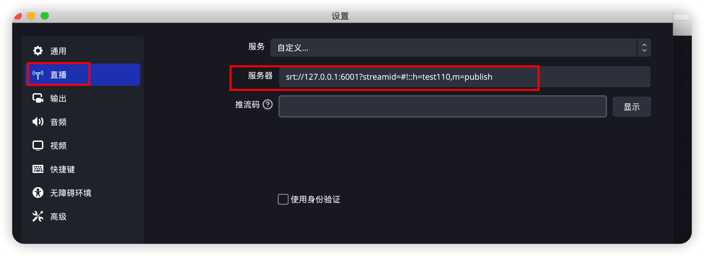
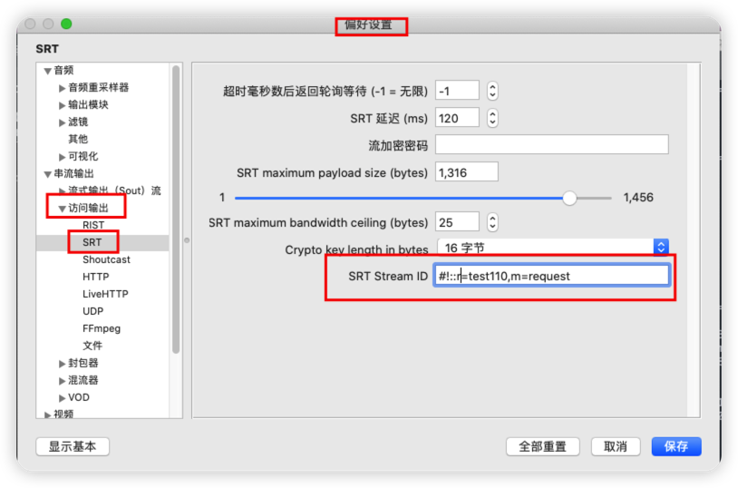
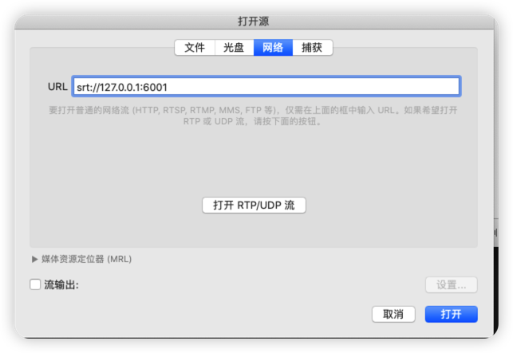
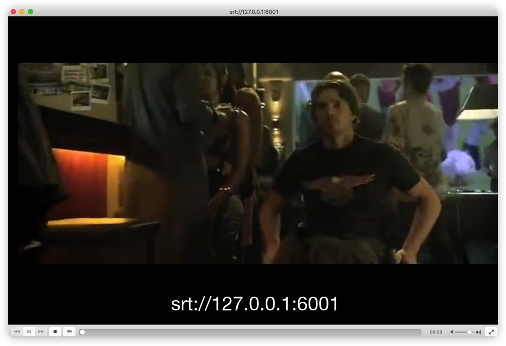

# SRT

SRT(Secure Reliable Transport)的简称,主要优化在不可靠网络(非阻塞导致的丢包)环境下实时音视频的传输性能

## 特点
（1） 基于UDP的用户态协议栈

（2） 抗丢包能力强&低延时

（3） 传输负载无关

（4） 传输加密

## 应用场景
(1) 上行最后一公里推流加速

(2) CDN内部传输分发加速

(3) 丢包重传率比较高的场景

## 支持的流媒体服务和工具
(1) OBS

(2) VLC

(3) FFmpeg,编译需集成libsrt

(4) SRS

(5) ZLMediaKit

(6) LALMax

## 测试
(1) 启动LalMax服务

(2) 使用OBS进行推流，在"直播"中输入srt的推流地址

(3) VLC进行播放

在VLC中设置streamid,这部分填streamid后面的所有信息

输入streamid前面的部分进行拉流

